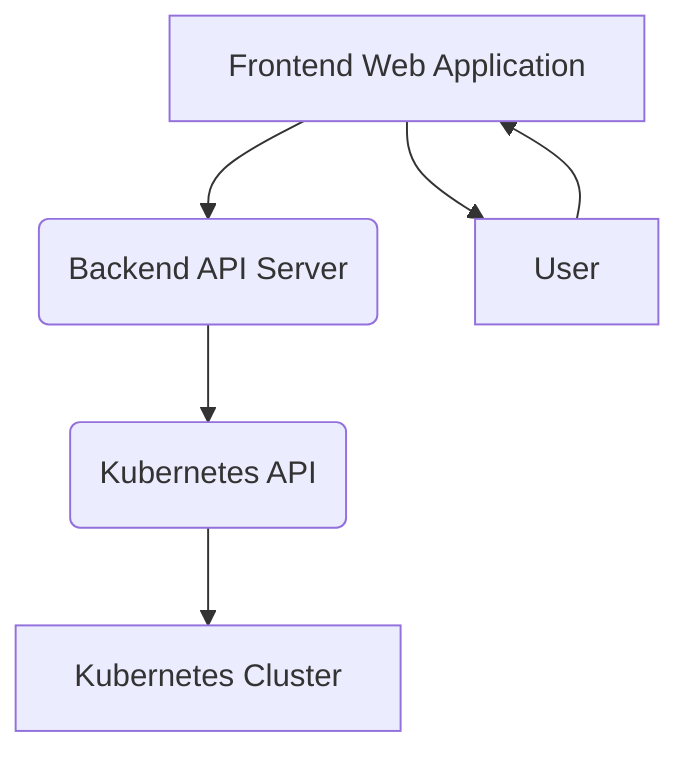

# Kubernetes Cluster Viewer and Manager: System Design

## 1. Introduction

This document outlines the system design for a visual Kubernetes cluster viewer and manager, inspired by the Obsidian graph view. The application will provide an intuitive, interactive graph representation of Kubernetes resources (nodes, pods, containers, services, deployments, etc.) and allow users to execute `kubectl` commands directly from the UI.

## 2. Core Requirements

*   **Visual Graph Representation:** Display Kubernetes resources as nodes and their relationships as edges in a force-directed graph layout, similar to Obsidian's graph view.
*   **Interactive UI:** Allow users to pan, zoom, drag nodes, and inspect resource details upon selection.
*   **Real-time Updates:** Reflect changes in the Kubernetes cluster dynamically in the graph and resource details.
*   **`kubectl` Command Integration:** Provide UI buttons and an integrated terminal for executing common `kubectl` commands.
*   **Resource Filtering and Search:** Enable users to filter and search for specific resources within the cluster.
*   **Cross-platform Compatibility:** A web-based application accessible via modern browsers.

## 3. System Architecture

The system will follow a client-server architecture, comprising a frontend web application, a backend API server, and interaction with the Kubernetes API.

### 3.1. Frontend Web Application

*   **Technology Stack:** React (with TypeScript) for component-based UI development.
*   **Graph Visualization:** `react-force-graph` (leveraging `d3-force-3d`) for rendering the interactive force-directed graph. Customization will be applied to achieve Obsidian-like aesthetics and interaction (e.g., stable relaxation, local drag influence).
*   **UI Framework:** Tailwind CSS or a similar utility-first CSS framework for rapid and consistent styling.
*   **State Management:** Redux Toolkit or Zustand for managing application state, including graph data, selected resources, and UI settings.
*   **Real-time Communication:** WebSocket client to connect to the backend for real-time cluster updates and `kubectl` command output.
*   **Terminal Emulation:** `xterm.js` for an integrated, interactive terminal for `kubectl` command execution and log streaming.

### 3.2. Backend API Server

*   **Technology Stack:** Node.js (with Express.js or Fastify) or Go (with Gin or Echo) for handling API requests and Kubernetes interactions. Node.js might be preferred for easier full-stack JavaScript/TypeScript development.
*   **Kubernetes Interaction:** Utilize an official Kubernetes client library (e.g., `kubernetes-client/javascript` for Node.js or `client-go` for Go) to communicate with the Kubernetes API server.
*   **Authentication and Authorization:** Implement secure authentication (e.g., OAuth2, service accounts) to interact with the Kubernetes API. Role-Based Access Control (RBAC) will be respected.
*   **Real-time Data Stream:** Maintain WebSocket connections with the Kubernetes API (e.g., for `watch` operations) to push real-time cluster changes to the frontend.
*   **`kubectl` Command Proxy:** Expose endpoints to proxy `kubectl` commands (e.g., `exec`, `logs`, `get`, `describe`, `delete`) to the Kubernetes API, streaming input/output via WebSockets for interactive commands.
*   **Data Caching:** Implement caching mechanisms for frequently accessed Kubernetes resource data to reduce API calls and improve performance.

### 3.3. Kubernetes API

*   The standard Kubernetes API will be used for all interactions. The backend will authenticate and authorize requests against this API.
*   **Watch API:** Crucial for real-time updates, allowing the backend to subscribe to changes in Kubernetes resources.
*   **Exec API:** Used for interactive terminal sessions within pods.
*   **Logs API:** Used for streaming container logs.

## 4. Key Components and Features

### 4.1. Graph Visualization Module

*   **Node Types:** Represent Kubernetes resources such as Nodes, Pods, Containers, Deployments, Services, Namespaces, etc.
*   **Edge Types:** Represent relationships like:
    *   Pod runs on Node
    *   Container belongs to Pod
    *   Deployment manages Pods
    *   Service targets Pods
    *   Resources belong to Namespace
*   **Layout Algorithm:** Force-directed graph layout with configurable parameters (e.g., link strength, charge, collision detection) to achieve a visually appealing and stable layout. Implement features for stable relaxation and local drag influence.
*   **Interactivity:** Zoom, pan, node dragging, node/edge highlighting on hover, and detailed information display on click.
*   **Styling:** Differentiate resource types by color, icon, and size. Display status (e.g., running, pending, error) visually.

### 4.2. Resource Detail Panel

*   Displays comprehensive information about a selected resource (YAML/JSON view, events, status, labels, annotations).
*   Context-sensitive actions (buttons) based on the resource type (e.g., restart pod, scale deployment, delete service).

### 4.3. `kubectl` Command Interface

*   **Command Palette/Buttons:** A set of pre-defined UI buttons for common `kubectl` operations (e.g., `get pods`, `describe pod <name>`, `logs <pod>`, `exec -it <pod> -- bash`).
*   **Integrated Terminal:** An `xterm.js` instance connected via WebSocket to the backend, allowing users to type and execute arbitrary `kubectl` commands directly.
*   **Output Streaming:** Real-time streaming of command output and logs to the terminal.

### 4.4. Search and Filtering

*   Global search bar to find resources by name, type, or label.
*   Filtering options based on resource type, namespace, status, and custom labels.

## 5. Technical Considerations

*   **Performance:** Optimizing graph rendering for large clusters (hundreds to thousands of nodes) will be critical. Techniques like canvas rendering (which `react-force-graph` supports), virtualization, and level-of-detail rendering will be explored.
*   **Security:** Secure communication between frontend and backend (HTTPS), secure authentication with Kubernetes, and strict authorization checks on all `kubectl` operations.
*   **Scalability:** The backend should be able to handle multiple concurrent users and real-time data streams efficiently.
*   **Error Handling:** Robust error handling and user feedback for API failures, `kubectl` command errors, and WebSocket disconnections.

## 6. Future Enhancements

*   **Resource Creation/Editing:** UI forms for creating and editing Kubernetes resources.
*   **Customizable Dashboards:** Allow users to create and save custom views and dashboards.
*   **Alerting and Monitoring Integration:** Connect with Prometheus/Grafana for deeper metrics and alerting.
*   **Multi-cluster Management:** Support for connecting to and managing multiple Kubernetes clusters.

## 7. References

[1] vasturiano/react-force-graph: React component for 2D, 3D, VR and AR force directed graphs - GitHub: https://github.com/vasturiano/react-force-graph
[2] How to implement an Obsidian-like Graph View (force layout + local drag influence + stable relax) — design advice? : r/d3js: https://www.reddit.com/r/d3js/comments/1r4bnhi/how_to_implement_an_obsidianlike_graph_view_force/
[3] xterm/xterm - npm: https://www.npmjs.com/package/@xterm/xterm?activeTab=readme
[4] How we Created an in-Browser Kubernetes Experience: https://dev.to/michaelguarino/how-we-created-an-in-browser-kubernetes-experience-a9l
[5] Kubernetes official documentation: https://kubernetes.io/docs/
